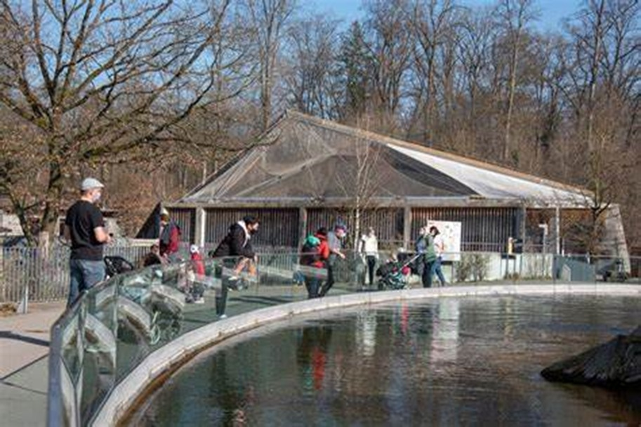
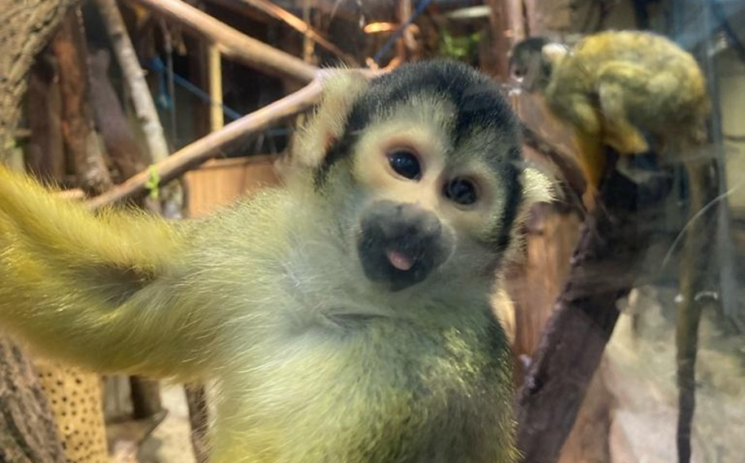
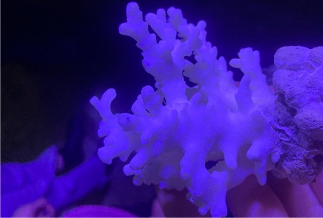
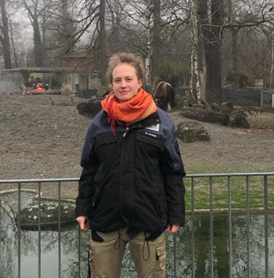

+++
title = "Blick hinter die Kulissen des Dählhölzli-Zoos "
date = "2024-02-16"
draft = false
pinned = true
+++
 Auf den ersten Blick erscheint der Zoo Dählhölzli in Bern als ein Ort der Unterhaltung und Bildung, wo Familien mit lachenden Kindern Tiere bewundern. Doch im Tierpark existieren zwei verschiedene Welten: eine, die für die Öffentlichkeit bestimmt ist, und eine andere, die sich hinter den Kulissen verbirgt. Jeder Besucher erlebt die sorgfältig arrangierte Fassade mit den Gehegen vieler verschiedener Tiere, während im Hintergrund eine Welt der Pflege, Organisation und Verwaltung existiert, die verborgen bleibt. Wir, zwei Schüler des Gymnasiums Hofwil, haben durch eine Führung an einem Abend im Januar 2024 den Kontrast erkundet. 

Charlie Gerl & Lionel Reusser

An einem winterlichen Freitagabend treffen wir uns mit einer Besuchergruppe auf einem Parkplatz vor dem Zoo Dählhölzli. Es ist kalt, windig und düster. Gespannt warten wir mit den anderen fünfzehn neugierigen Besuchern auf die Abend-Führung durch den Tierpark. Vendolin Uhr, eine junge, engagierte Zooführerin, empfängt uns herzlich und führt uns durch den Hintereingang ins Vivarium, wo die Führung beginnt. Im Inneren hört man die Affen kreischen und im Hintergrund Arbeitsgeräusche von Bauarbeitern. Da es warm ist, ziehen wir unsere Jacken aus und folgen Frau Uhr zum Totenkopfäffchen-Gehege.

Vor der Führung waren wir schon einmal im Tierpark. Was uns damals als erstes ins Auge stiess, waren süsse Totenkopfäffchen, die glücklich in ihrem Gehege herumsprangen. Einige spielten miteinander oder rannten einander hinterher. Andere assen Salat und starrten uns interessiert an. Wir fragen uns, wie gut es diesen Tieren hier geht. Werden sie nicht von den Menschen gestresst? Haben sie genug Platz und Rückzugsmöglichkeiten? Das sehen wir uns in der Führung genauer an.

### Saimiri: die weibliche Affen-Chefin

Der biologische Fachbegriff für Totenkopfäffchen lautet Saimiri. Sie sind sehr neugierige und soziale Tiere, die bis zu 35 Jahre alt werden können. Die ca. 900 Menschen, die jeden Tag vorbeikommen, werden von den Äffchen genauso wahrgenommen, wie auch wir sie wahrnehmen. Das heisst, dass sie auch sehr an uns interessiert sind. Im Dählhölzli gibt es neun Saimiris, die zum Teil dort aufgewachsen sind oder aus anderen Zoos und Zirkussen gerettet wurden. Bei diesen Affen ist die Familie das Wichtigste. Hier leben nur weibliche Saimiris. Bei den gelb-schwarzen Äffchen sind die Weibchen die Chefinnen. Die Männchen, die sich nicht gut in die Familien integrieren, werden von ihnen in freier Wildbahn weggeschickt und kommen die Familie nur ab und zu besuchen. Da es in einem Zoo schwierig ist, einen speziellen Ort für die Männchen einzurichten, gibt das Dählhölzli die Männchen in andere Zoos, wo sie besser gehalten werden und sich wohler fühlen. Damit den Saimiris in ihrem Gehege nicht langweilig wird, fügt der Zoo ständig neue Gegenstände hinzu. Falls ihnen die ganze Aufmerksamkeit zu viel wird, laufen sie zu einem kleinen Tunnel. Dieser führt zu einem zweiten, grösseren Gehege, in dem sie sich besser beruhigen können. Schliesslich verfügen sie auch noch über einen dritten Raum, der zur Isolation dient, wenn sie zum Beispiel krank sind.

### Ein Zoo mit hohen Standards

Zur Sicherstellung der artgerechten Haltung gehört der Zoo Dählhölzli einem internationalen Dachverband namens EAZA an. EAZA steht für «European Association of Zoos and Aquaria». Das Ziel dieses Dachverbandes ist die Vergabe eines Qualitätssiegels. Dafür kontrollieren sie im Rahmen von Vor-Ort-Besuchen etwa alle 5 Jahre den Zoo. Sie schauen, ob die Tierhaltung sowohl den modernsten nationalen wie auch internationalen Normen entspricht.

> *„Ich würde sagen, dass wir ein guter Zoo sind.“*
>
> *Meret Huwiler*

Auch national wird der Zoo regelmässig kontrolliert. So kommen das kantonale Veterinäramt und das Bundesamt für Veterinärwesen vorbei. «Wir arbeiten ganz nahe mit ihnen zusammen, um eben genau diese Qualität sicher zu stellen. Ich würde sagen, dass wir ein guter Zoo sind. Wir geben uns besonders Mühe, denn wir sind mit der Wissenschaft verbunden und wir haben relativ grosse Anlagen, die gut gefüllt sind», erklärt uns Frau Huwiler, die Kuratorin des Dählhölzlis stolz. Sie meint, dass die Grösse des Geheges wichtig wäre, aber auch weitere Faktoren eine Rolle spielen würden. «Tiergerechtes Futter, Populationsmanagement, Gesundheitsmanagement, Netzwerk mit anderen Zoos, Bildungsangebote sowie Naturschutz sind auch wesentliche Elemente», präzisiert Frau Huwiler. 

 **EAZA** 

Die EAZA ist die «European Association of Zoos and Aquaria», ein Verband von Zoos und Aquarien in Europa. Ihr Hauptziel ist es, den Naturschutz durch Zusammenarbeit, Forschung und Bildung zu fördern. Mitglieder verpflichten sich zu hohen Standards in Tierpflege und Artenschutz. Der Verband koordiniert Zuchtprogramme für gefährdete Arten und unterstützt Naturschutzprojekte weltweit. Die Organisation trägt dazu bei, das Bewusstsein für Umweltfragen zu schärfen und die biologische Vielfalt zu erhalten. 

Unsere Führung mit Frau Uhr geht weiter. Dabei geht es durch mehrere Räume, in denen normalerweise das Personal arbeitet, bis wir in einer Küche ankommen.

### Artengerechtes Futter

Das Essen der Tiere wird vom Dählhölzli in eigenen Küchen zubereitet. Es gibt verschiedene für unterschiedliche Tierarten. Wir schauen uns die Küche für Affen und Vögel an, in der unterschiedliches Futter präpariert wird. Sie ist relativ gross und es riecht streng. «Hier wird gerade ein Bambusrohr, in dem die Köche Mehlwürmer reinsetzen für die Affen, präpariert», zeigt uns Frau Uhr. Beim Verlassen der Küche gelangen wir in einen Gang, an den weitere Küchen und Räume für die Futterlagerung angrenzen. Ganz am Ende des Ganges führt eine Treppe hinunter zur Metzgerei. Beim Betreten des Raumes sticht uns ein starker Fischgeruch in die Nase. Der Zoo benötigt die Metzgerei, um Fleisch für die Tiere vorzubereiten. Unter anderem schlachten sie Hühner, die dann in einem kalten Raum gelagert und schliesslich den Raubtieren verfüttert werden.

> *«Wenn Tiere, zum Beispiel Rehe, in der Nähe überfahren werden, kommen sie auch in den Zoo»*
>
> *Vendolin Uhr*

Der Zoo erhält auch Fleisch mit abgelaufenem Verkaufsdatum, das sie, wenn es noch essbar ist, auch den Raubtieren zum Fressen geben. «Wenn Tiere, zum Beispiel Rehe, in der Nähe überfahren werden, kommen sie auch in den Zoo», erklärt uns Frau Uhr. «Sie werden über einen speziellen Lift zur Metzgerei transportiert und dann nach einem gründlichen Krankheitscheck den Raubtieren verfüttert.»

Wir gehen weiter eine kleine Treppe hinauf und kommen in einen dunklen Raum mit vielen grossen Wasserbecken.

### Sorgfältige Zucht von Korallen

Das Dählhölzli besitzt einen grossen Raum, in dem Korallen gezüchtet werden. Diese werden in verschiedenen Becken gehalten, die unterschiedlich beleuchtet sind. Je nach Korallenart braucht es zudem andere Temperaturen, die konstant bleiben müssen.

Jeden Tag muss eine Nährlösung in die Becken gegossen werden, damit die Korallen gut wachsen. Die Beachtung dieser Punkte ist elementar, damit die Korallen nicht an Korallenbleiche erkranken. In diesem Zustand verlieren sie alle Farbe, um letzte Kraft zu sparen, bevor sie sterben. Sie können sich wieder erholen. Wird jedoch zu lange gewartet, sterben sie ab. Wenn die Korallen erwachsen sind, werden sie entweder in ein Becken mit Fischen gesetzt oder an andere Zoos verkauft. 

### Zum Schluss eine kleine Überraschung

Frau Uhr bringt uns zurück zum Haupteingang. Dort hat sie noch eine letzte Überraschung für uns und kommt mit einer Königspython namens Klaus im Arm zurück. Klaus lebt in einem Gehege, das bei einem normalen Besuch nicht zu sehen ist. Er kommt nur hervor, um gestreichelt zu werden. Frau Uhr erklärt uns, wie wir ihn artgerecht anfassen dürfen. So darf diese Schlange nicht mit dreckigen Händen angefasst werden, denn das könnte Krankheiten übertragen. Man soll sie wie eine Katze von oben nach unten streicheln und ihren Kopf nicht berühren, weil sie dann reflexhaft beissen könnte.

Abschliessend dürfen wir Klaus auf den Arm nehmen. Erstaunlicherweise ist die Haut der Schlange nicht kalt und schleimig, sondern trocken mit Zimmertemperatur. Nach dieser eindrücklichen Begegnung ist unsere Führung zu Ende. Frau Uhr bringt Klaus zurück in sein Gehege, geleitet und danach nach draussen und verabschiedet sich.

Im Rahmen dieser Reportage haben wir erlebt, dass viele Anforderungen hinter den Kulissen erfüllt sein müssen, damit es den Tieren gut geht und die Besucher auch in Zukunft ein ungetrübtes Erlebnis im Zoo geniessen können. Die Besucher machen sich über viele Aspekte keine Gedanken, wie zum Beispiel, ob die Tiere genug Platz haben, dass es extra Küchen gibt, um den Tieren das Futter artgerecht zu präparieren, oder dass der Zoo eng mit der Wissenschaft zusammenarbeitet. Das alles wurde uns durch die Führung und das Gespräch mit der Kuratorin klar. Ab jetzt werden wir, wenn wir wieder in den Zoo gehen, eine ganz andere Sicht auf das komplexe Zusammenwirken haben.

 **Meret Huwiler**

Die 30-jährige Meret Huwiler ist eine der beiden Kuratorinnen des Zoos. Mit ihr haben wir das Interview zu unserer Reportage geführt. Sie kümmert sich um Tierbestand, Tierhaltung, Personal und Wohlbefinden der Tiere. Sie ist durch ein Schnuppern im Zoo Zürich auf die Idee gekommen, Kuratorin zu werden. Dabei hat sie erfahren, dass sie für diese Aufgabe Biologie studieren sollte. Während dieses Studiums arbeitete sie auch als Tierpflegerin im Papiliorama. Ihre Masterarbeit hat sie im Zoo Basel geschrieben. 