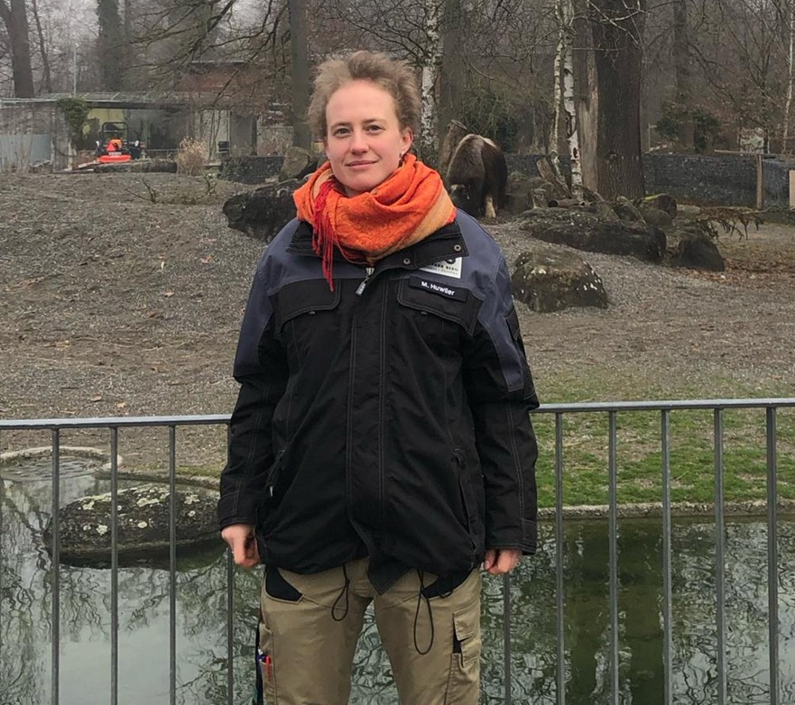

+++
title = "Einen Blick hinter die Kulissen des Dählhölzli-Zoos als Kuratorin"
date = "2024-02-26"
draft = false
pinned = false
image = "whatsapp-image-2024-02-26-at-21.21.32.jpeg"
description = "In einem lebendigen Tierpark, wo die Vielfalt der Natur erlebbar wird, steht eine Kuratorin im Mittelpunkt des Geschehens. Mit einem feinen Gespür und einer tiefen Verbundenheit zu den Tieren lenkt sie die Angelegenheiten des Zoos. Ihre Tage sind geprägt von Büroarbeit und direkter Interaktion mit den Lebewesen, um sicherzustellen, dass jedes Tier in ihrem Gehege gut versorgt ist."
+++
In einem lebendigen Tierpark, wo die Vielfalt der Natur erlebbar wird, steht eine Kuratorin im Mittelpunkt des Geschehens. Mit einem feinen Gespür und einer tiefen Verbundenheit zu den Tieren lenkt sie die Angelegenheiten des Zoos. Ihre Tage sind geprägt von Büroarbeit und direkter Interaktion mit den Lebewesen, um sicherzustellen, dass jedes Tier in ihrem Gehege gut versorgt ist.

Lionel Reusser & Charlie Gerl

Es ist der 18. Dezember 2023. Wir, zwei Schüler aus dem Gymnasium Hofwil, warten an der Kasse des Zoos Dählhölzli in Bern, wo uns unsere Interviewpartnerin Meret Huwiler abholen kommt. Pünktlich erscheint die 30-jährige Zookuratorin an der Kasse. Sie begrüsst uns und fragt, was unser Lieblingstier ist, damit wir vor dem Gehege dieses Tieres das Interview führen können. Wir entscheiden uns das Interview draussen vor den Robben durchzuführen. Während wir dort hinlaufen, bekommt Frau Huwiler schon das erste Telefonat. Im Hintergrund hören wir aufgeregte Stimmen von Kindern, die ihre Begeisterung über die Tiere zum Ausdruck bringen. Draussen angekommen sticht die Kälte ins Gesicht und es nieselt leicht. Das Interview mit Frau Huwiler beginnt.

**Was ist genau der Beruf Kuratorin und wie sieht ein normaler Arbeitstag aus?**

Ich bin Zookuratorin, eine von zweien hier im Tierpark. Wir sind für den Tierbestand zuständig. Das heisst dafür, welche Tiere wir hier halten, dann die Tierhaltung an sich, also zum einen die rechtlichen Sachen, damit wir der Tierschutzverordnung und den Tierschutznormen der Schweiz entsprechen. Weil wir aber auch ein internationaler Zoo sind, müssen wir auch schauen, dass wir die europäischen und weltweiten Normen erfüllen. Dann sind wir auch dafür verantwortlich, dass es den Tieren gut geht und sich die Tierpfleger*innen gut um die Tiere kümmern. Wir arbeiten auch sehr eng mit dem Tierarzt und der Wissenschaft zusammen, damit wir immer auf dem neusten Stand sind. Eine weitere wichtige Aufgabe von uns ist der Tiertransport, sowie auch das Populationsmanagement, also dass wir mitbestimmen, wo welches Tier hingeht. Insgesamt haben wir damit ein sehr, sehr breites Aufgabengebiet.

Wie eben schon gesagt, sind wir zwei Zookuratorinnen. Dabei haben wir den Zoobestand aufgeteilt. Ich bin zuständig für die Vögel, Huftiere, Affen und Käfer.

**Arbeiten Sie viel mit den Tieren zusammen oder besteht Ihre Arbeit eher aus Büroarbeit?**

Das Verhältnis beträgt etwa drei zu eins. Viel ist Büroarbeit, also die ganze Organisation und Koordination. Mit den Tieren draussen bin ich, wenn es um spezielle Aufgaben geht, z.B. wenn wir eine Kontrolle haben oder wenn es ein verletztes Tier gibt. Ich schaue aber auch, dass ich einmal täglich im Zoo eine Runde mache, damit ich mir selbst ein Bild davon machen kann, wie es den Tieren geht.

**Immer wieder gibt es Debatten, ob Zoos tiergerecht sind. Was ist Ihre persönliche Meinung zu den Zoos?**

Hier ist wichtig zu sagen, dass ein Zoo keine geschützte Bezeichnung ist. Das heisst, wenn ich jetzt zuhause fünf Tierarten habe und sage, für einen Franken Eintritt kann man die anschauen kommen, dann kann ich das schon einen Zoo nennen. Das macht es natürlich sehr schwierig zu unterscheiden, was ein guter Zoo ist und was ein schlechter. Und darum gehören wir einer Vereinigung, einem Dachverband an, der EAZA (European Association of Zoos and Aquaria) heisst. Die Aufgabe dieses Dachverbandes ist es ein Qualitätssiegel zu vergeben. Sie kommen regelmässig den Zoo kontrollieren, also etwa alle 5 Jahre, und schauen, ob unsere Tierhaltung sowohl den modernsten nationalen als auch internationalen Normen entsprechen. Auch von den nationalen Behörden werden wir immer wieder kontrolliert. Da kommt von Zeit zu Zeit das Veterinäramt vorbei und auch der Bund, so dass wir eng mit ihnen zusammenarbeiten, um eben genau diese Qualität sicherzustellen. Ich würde sagen, dass wir ein guter Zoo sind, denn wir geben uns grosse Mühe, sind mit der Wissenschaft verbunden und haben grosse, gut gefüllte Anlagen. Dabei ist bezüglich der Anlage nicht allein die Grösse entscheidend, sondern es kommt auch auf das „Drumherum“ an. Damit ist unter anderem gemeint, dass wir tiergerechtes Futter sowie ein Populations- und ein Gesundheitsmanagement haben. Weiter ist wichtig, dass unser Tierpark mit anderen Zoos verknüpft ist, gute Bildungsangebote hat und mit dem Naturschutz gekoppelt ist. Wir müssen also viele unterschiedliche Anforderungen erfüllen, damit wir ein guter Zoo sind.  

> „*Die Auswilderung ist aber so zu sagen die Kirsche auf der Torte, also es ist wirklich nur ein kleiner Teil*“
>
> *Meret Huwiler*

**Was sind die speziellen Bemühungen des Zoos für gefährdete Tierarten?**

Es gibt viele verschiedene Möglichkeiten, wie man mit gefährdeten Tierarten umgehen kann. Zum einen, damit haben Zoos zunächst begonnen, dass man Tiere züchtet und sie dann auswildert. Die Auswilderung ist aber so zu sagen die Kirsche auf der Torte, also es ist wirklich nur ein kleiner Teil. Alles andere, was vorher gemacht werden muss, ist der viel wichtigere Teil. So beurteilen wir zum Beispiel den Lebensraum. Warum ist ein Tier ausgestorben oder gefährdet? Davon macht man Aufnahmen. Bei diesen Aufnahmen arbeiten Universitäten, NGO und zum Teil auch die lokale Bevölkerung mit. Dann schauen wir, was man unternehmen kann, damit diese Tiere nicht aussterben. Ein Beispiel dafür ist, wenn ein Teil der Bevölkerung ein bestimmtes Tier isst und man dann nach einem Ersatz suchen muss. Erst nach dieser Vorbereitung und nachdem gewährleistet werden kann, dass das Tier in der Wildnis zurechtkommt, findet eine Auswilderung statt. Das ist ein wichtiger Aufgabenteil für unsere Zoos, denn wir haben die Anlagen und wir haben das Wissen, wie man die Tiere züchtet und auswildert und wie man dies alles richtig managet.

**Seitdem eine neue Zoo-Direktorin begonnen hat, gibt es viele Veränderungen im Tierpark. Ein Beispiel ist, dass der Kinderzoo abgebaut wird. Was halten Sie davon?**

Ich unterstütze diese neuen Veränderungen völlig. Es ist Teil einer Gesamtplanung für die nächsten 10 Jahre. So wie viele andere Unternehmen haben auch wir einen „Masterplan“, in dem die Ausrichtung festgelegt wird. Ich habe bei unserem selbst mitgeschrieben.

Bezüglich der Medienberichterstattung darüber mussten wir feststellen, dass unsere Veränderungen bezüglich des Kinderzoos so dargestellt wurden, als würden wir etwas Böses wollen und den Kindern etwas wegnehmen. Es ist aber so, dass wir bald etwas Neues vorstellen, was deutlich zeitgemässer ist. Denn wir haben uns die Frage gestellt, ob unser Zoo wirklich die Funktion eines Bauernhofes haben sollte oder ob wir nicht eher darauf fokussieren sollten, was einen modernen Zoo wirklich ausmacht.

**Definition Zoo**

Als Zoo oder zoologischen Garten bezeichnet man eine der Öffentlichkeit zugängliche dauer-hafte Einrichtung insbesondere zur Haltung seltener oder exotischer Wildtiere. In der Schweiz gibt es fünf als wissenschaftlich anerkannte zoologische Gärten (Basel, Zürich, Bern, Goldau und Langenberg) sowie rund 120 weitere öffentlich zugängliche Wildtierhaltungen (Kleinzoos, Tierparks, Volieren, Storchenkolonien etc.) mit heimischen oder exotischen Tierarten. Während sie früher in erster Linie auf die Unterhaltung ihrer Besucher ausgerichtet waren, erheben Zoos heute den Anspruch, auch Aufgaben in den Bereichen Öffentlichkeitsarbeit, Forschung und Artenschutz zu erfüllen. (Quelle: www.tierimrecht.org/de/recht/lexikon-tierschutzrecht/Zoo/)

``